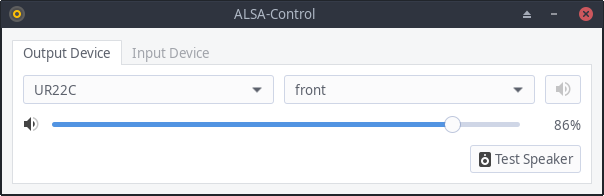

# ALSA Control

**This is in a very early stage of development!**

Making ALSA easy to use.

Since ALSA provides dmix for soundcards that don't support multiplexing, it is not necessary to run pulseaudio for that.
Pulseaudio can have issues with sample rates of USB devices, which will be avoided by not using it.
Furthermore, pure ALSA should have the lowest possible audio latency.

## Usage

It will try to select a default soundcard when no config file exists yet. The config is in `~/.config/alsacontrol/config`

```
pip3 install pyalsaaudio
python3 setup.py install
```

**User interface**

```
alsacontrol-gtk
```

<p align="center">
    
</p>


**Starting the daemon to control volume via multimedia keys**

Start the daemon. You can put this into your autostart.

```
alsacontrol-daemon-gtk
```

Change the volume. For convenience, bind this to your multimedia keys in your user interface

```
alsacontrol -v +5
alsacontrol -v -5
alsacontrol -m
```

<p align="center">
    
</p>


## Testing

```
pylint alsacontrol --extension-pkg-whitelist=alsaaudio
sudo python3 setup.py install && python3 tests/test.py
```


## Goals

Basically provide everything that is needed to comfortably use ALSA in a GUI

Features
- [x] Show a volume meter as notification on volume changes or mute toggling
- [x] Change the volume of soundcards without Master controls with softvol
- [x] Generate an asoundrc file that is automatically included in ~/.asoundrc based on config
- [x] Add GTK GUI
- [ ] Control volumes with sliders and a mute button
- [x] Always show up to date devices in the GUI
- [x] Add a button to test the speaker setup
- [x] Show speaker-test errors in the GUI
- [x] Add a dropdown to change output pcm devices
- [ ] Jack support
- [ ] Add a list of input devices and show their input level
- [ ] Notify about new detected audio devices with a button to open the GUI to select it
- [ ] Provide .deb files and get it into the AUR

Quality
- Provide tooltips for anything that is not easily self explanatory
- Show when the user is supposed to restart their applications for it to take effect
- Make it easy to write GUIs for this in alternative libraries by properly separating code
- Provide well written docstrings
- Don't automatically switch devices when the current device is not available. But maybe add user defined fallback devices
- Be verbose with logs, provide debug logs. All logs start uppercase

