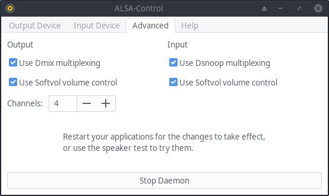

# ALSA Control

Since ALSA provides dmix for soundcards that don't support multiplexing and softvol for those that can't control their volume,
it is not necessary to run pulseaudio for that. This application creates .asoundrc default configurations for this purpose,
while the GUI may work as a replacement for pavucontrol.

Not having pulseaudio is not compatible with everything. For example, Discord in Firefox and Terraria were silent without Pulseaudio.
Maybe [apulse](https://github.com/i-rinat/apulse) helps.

If you encounter problems, don't hesitate to open an issue in this repo!

## Jack

You can use this to control the volume while running jack. Firefox seems to prefer talking to
jack directly over using the default device provided by the generated asoundrc though, so the
volume change doesn't affect it. Before starting jack, the ALSA-Control GUI needs to be closed because
jack can't acquire the input device as long as the level is monitored, or you select "none" as input
in Cadence.

## Usage

Install [alsa-control from the AUR](https://aur.archlinux.org/packages/alsa-control/) or run:

```
pip3 install pyalsaaudio
python3 setup.py install
```

It should create an entry in your applications menu. But you can also start it from the console:

```
alsacontrol-gtk
```

<p align="center">
    
</p>
<p align="center">
    
</p>

If the daemon didn't already start due to a system restart, you can start it either from the user interface, or with:

```
alsacontrol-daemon-gtk
```

While the above command runs in a separate terminal, try to change the volume with the following commands.
For convenience, bind this to your multimedia keys in your user interface.

```
alsacontrol -v +5
alsacontrol -v -5
alsacontrol -m
```

<p align="center">
    
</p>

Running pulseaudio at the same time may cause problems. Keyboard shortcuts may break if you have the xfce pulseaudio plugin active.

## Features

Basically provide everything that is needed to comfortably use ALSA without pulseaudio in a GUI

- [x] Show a volume meter as notification on volume changes or mute toggling
- [x] Change the volume of soundcards without Master controls with softvol
- [x] Generate an asoundrc file that is automatically included in ~/.asoundrc based on config
- [x] Control volumes with sliders and a mute button
- [x] Always show up to date devices in the GUI
- [x] Add a button to test the speaker setup
- [x] Show speaker-test errors in the GUI
- [x] Add a dropdown to change output pcm devices
- [x] Jack support (first start jack, then the GUI to select it)
- [x] Add a list of input devices and show their input level
- [x] Startmenu .desktop entry
- [x] Start the daemon on login
- [x] Make dmix, softvol, dsnoop, channels and samplerate configurable
- [x] Get it into the AUR
- [x] Write specs for the UI (using stubs for pyalsaaudio)
- [ ] Provide .deb files

## Testing

```
pylint alsacontrol --extension-pkg-whitelist=alsaaudio
sudo python3 setup.py install && python3 tests/test.py
```
