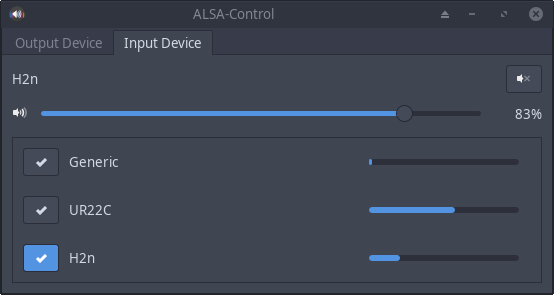

# ALSA Control

Since ALSA provides dmix for soundcards that don't support multiplexing and softvol for those that can't control their volume,
it is not necessary to run pulseaudio for that.

This software provides multiplexing, volume and muting capabilities by creating .asoundrc configurations, while the GUI
works as a replacement for pavucontrol.

## Usage

It will try to select a default soundcard when no config file exists yet. The config is in `~/.config/alsacontrol/config`

```
pip3 install pyalsaaudio
python3 setup.py install
```

**User interface**

```
alsacontrol-gtk
```

<p align="center">
    
</p>

**Starting the daemon**

Start the daemon. You can put this into your autostart.

```
alsacontrol-daemon-gtk
```

Change the volume. For convenience, bind this to your multimedia keys in your user interface

```
alsacontrol -v +5
alsacontrol -v -5
alsacontrol -m
```

<p align="center">
    
</p>


## Features

Basically provide everything that is needed to comfortably use ALSA without pulseaudio in a GUI

- [x] Show a volume meter as notification on volume changes or mute toggling
- [x] Change the volume of soundcards without Master controls with softvol
- [x] Generate an asoundrc file that is automatically included in ~/.asoundrc based on config
- [x] Add GTK GUI
- [x] Control volumes with sliders and a mute button
- [x] Always show up to date devices in the GUI
- [x] Add a button to test the speaker setup
- [x] Show speaker-test errors in the GUI
- [x] Add a dropdown to change output pcm devices
- [x] Jack support (first start jack, then the GUI to select it)
- [x] Add a list of input devices and show their input level
- [ ] Start the daemon on login
- [ ] Provide .deb files and get it into the AUR

## Jack

Changing jacks volume via softvol doesn't feel responsive. Firefox seems to prefer
talking to jack directly over using the default device provided by the generated asoundrc, so the
volume change doesn't affect it. Before starting jack, the ALSA-Control GUI needs to be closed because
jack can't acquire the input device as long as the level is monitored.

## Testing

```
pylint alsacontrol --extension-pkg-whitelist=alsaaudio
sudo python3 setup.py install && python3 tests/test.py
```
